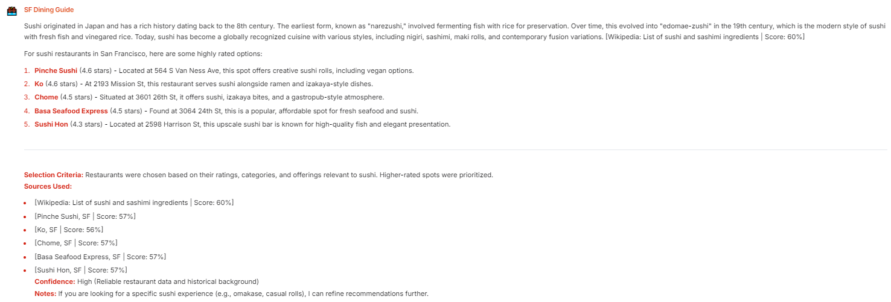
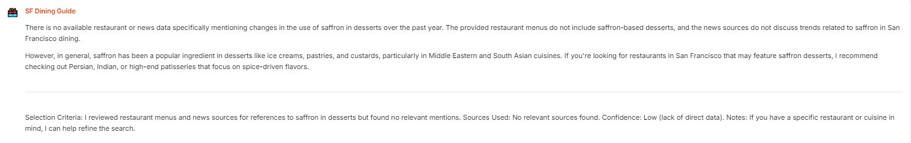

# San Francisco Dining RAG Chatbot

This repository demonstrates a Retrieval Augmented Generation (RAG) pipeline that integrates both structured and unstructured data. It answers queries about restaurants, menus, ingredients, and more in San Francisco. The application uses OpenAI’s 'gpt-4o' model for understanding questions and generating context-aware responses, while Pinecone is used for embedding storage vector-based similarity search.

---

## Table of Contents
1. [Overview of the Architecture](#overview-of-the-architecture)  
2. [Frontend Overview](#frontend-overview)  
3. [Backend Key Scripts](#backend-key-scripts)  
4. [Data Ingestion & Indexing](#data-ingestion--indexing)  
   - [Five Chunk Types](#five-chunk-types)  
5. [Prompt & Retrieval Pipeline](#prompt--retrieval-pipeline)  
6. [Mermaid Diagram](#mermaid-diagram)  
7. [Five User Stories/Queries (with Image Placeholders)](#five-user-storiesqueries-with-image-placeholders)  
8. [Future Extensions & Scalability](#future-extensions--scalability)

---

## Overview of the Architecture

1. **Data Ingestion:** Multiple sources—restaurant CSV data, Wikipedia articles, and news articles—are scraped or processed to create structured chunks of text.  
2. **Embedding & Indexing:** Each chunk is converted into a vector embedding (via OpenAI's text-embedding-3-small model) and stored in Pinecone for similarity-based retrieval.  
3. **Query Handling (Frontend):** The user query is received through a Next.js frontend route.  
4. **Retrieval:** The backend obtains relevant chunks from Pinecone.  
5. **Prompt Construction:** The matched chunks are fed into the LLM as additional context.  
6. **Response Generation:** The LLM uses these chunks (and additional instructions) to return a final answer.

---

## Frontend Overview

In addition to the “route.ts” file—which handles the streaming of chat responses—the frontend includes:
- A Next.js page or React component where users can type queries.  
- Real-time updates that show partial LLM responses as they stream in.  

In “route.ts,” the crucial flow is:
1. We receive the user’s query.  
2. (Optionally) optimize or rewrite the query for better retrieval.  
3. Perform a Pinecone lookup on different indexes.  
4. Assemble relevant context chunks and stream them (alongside the LLM’s final answer) back to the client.

---

## Backend Key Scripts

1. **@news_scraper.py**  
   - Scrapes or fetches news articles from external sources.  
   - Splits articles into logical chunks (title vs content).  
   - Saves JSON chunks with metadata (date published, source, URL, etc.).

2. **@wikipedia_scraper.py**  
   - Uses Wikipedia’s API to get food/cuisine/restaurant-related articles.  
   - Cleans and splits articles into chunks.  
   - Stores them in JSON, ready for embedding.

3. **@clear_pinecone.py**  
   - Clears a given Pinecone index.  
   - Used to re-initialize or refresh data.

4. **@process_news_chunks.py**  
   - Reads the news chunks JSON (from @news_scraper.py).  
   - Generates embeddings for each chunk using OpenAI.  
   - Uploads them to Pinecone with optional weighting (e.g., time decay).

5. **@process_wikipedia_chunks.py**  
   - Similar flow for Wikipedia data.  
   - Validates each chunk, computes embeddings, and pushes them to Pinecone.

6. **@rag_indexer.py**  
   - Handles the proprietary restaurant data (CSV files).  
   - Splits the data into chunks for different aspects (like categories, menu items, reviews).  
   - Embeds each chunk and stores it in Pinecone (e.g., “restaurant-chatbot” index).

---

## Data Ingestion & Indexing

Below is the general procedure:

1. **Scrape or Load Data**  
   - @wikipedia_scraper.py to fetch relevant Wikipedia articles.  
   - @news_scraper.py to gather news articles.  
   - @rag_indexer.py for restaurant CSV data.

2. **Generate Chunks**  
   - Each script organizes text into smaller pieces (“chunks”) based on context, ensuring each chunk has relevant metadata.  

3. **Embedding & Vector Store Upload**  
   - @process_wikipedia_chunks.py and @process_news_chunks.py read the chunk files, generate embeddings, and upload to Pinecone.  
   - @rag_indexer.py handles embedding for the restaurant dataset.  

### Five Chunk Types

1. **Restaurant Chunks** (from `@rag_indexer.py`)  
   - **Type A (Restaurant Info):**  
     ```json
     {
       "id": "restaurant_xyz_info",
       "text": "Detailed metadata about the restaurant...",
       "tokens": 100,
       "embedding": [...],
       "metadata": {
         "type": "restaurant_info",
         "source": "restaurant",
         "restaurant_name": "XYZ Cafe",
         "rating": 4.5,
         "price": "$$",
         "categories": ["Italian", "Pizza"],
         "address": "123 Main St"
       }
     }
     ```
   - **Type B (Menu Category):**  
     ```json
     {
       "id": "restaurant_xyz_category_pizza",
       "text": "Pizza, Pepperoni Pizza, Margherita Pizza...",
       "tokens": 80,
       "embedding": [...],
       "metadata": {
         "type": "menu_category",
         "source": "menu",
         "restaurant_name": "XYZ Cafe",
         "category": "Pizza",
         "item_count": 5,
         "total_items": 20,
         "rating": 4.5,
         "price": "$$"
       }
     }
     ```
   - **Type C (Menu Item):**  
     ```json
     {
       "id": "restaurant_xyz_item_pepperoni_pizza",
       "text": "Pepperoni Pizza with fresh tomatoes and cheese...",
       "tokens": 45,
       "embedding": [...],
       "metadata": {
         "type": "menu_item",
         "source": "menu",
         "restaurant_name": "XYZ Cafe",
         "item_name": "Pepperoni Pizza",
         "ingredients": ["Pepperoni", "Cheese", "Tomato Sauce"],
         "rating": 4.5,
         "price": "$$"
       }
     }
     ```

2. **Wikipedia Chunks** (from `@process_wikipedia_chunks.py`)  
   ```json
   {
     "id": "wiki_abc123",
     "text": "Sushi is a traditional Japanese dish of prepared vinegared rice...",
     "tokens": 120,
     "embedding": [...],
     "metadata": {
       "title": "Sushi",
       "source": "wikipedia",
       "type": "article",
       "url": "https://en.wikipedia.org/wiki/Sushi"
     }
   }
   ```

3. **News Chunks** (from `@process_news_chunks.py`)  
   ```json
   {
     "id": "news_def456",
     "text": "Recent trends show a 20% increase in dessert popularity...",
     "tokens": 95,
     "embedding": [...],
     "metadata": {
       "source": "nytimes",
       "title": "Dessert Trends Are Soaring",
       "url": "https://nytimes.com/news/food-desserts",
       "publish_date": "2023-10-01T12:00:00",
       "chunk_type": "content",
       "type": "article"
     }
   }
   ```

---

## Prompt & Retrieval Pipeline

1. **User Query:** For example, “What’s the best cheap Italian restaurant near me?”  
2. **Query Embedding:** The system transforms the query text into a vector representation.  
3. **Vector Search:** Pinecone returns the top matching chunks from each index.  
4. **Prompt Construction:** These chunks are combined into a single prompt for the LLM.  
5. **LLM Completion:** The LLM draws on these chunks plus instructions to generate a final answer.  

---

## Mermaid Diagram

Below is a simplified diagram of the code flow. An image version has been placed at [images/mermaid_diagram.png](images/mermaid_diagram.png):


---

## Five User Stories/Queries

1. **Ingredient-Based Discovery**  
   - Query: "Which restaurants in San Francisco offer dishes with Impossible Meat?"  
   

2. **Trending Insights & Explanations**  
   - Query: "Give me a summary of the latest trends around desserts in San Francisco."  
   

3. **Historical or Cultural Context**  
   - Query: "What is the history of sushi, and which restaurants in my area are known for it?"  
   

4. **Comparative Analysis**  
   - Query: "Compare the average menu price of vegan restaurants in San Francisco vs. Mexican restaurants."  
   

5. **Menu Innovation & Flavor Trend**  
   - Query: "How has the use of saffron in desserts changed over the last year, according to restaurant menus or news articles?"  
   

---

## Future Extensions & Scalability

- **Real-Time Updates:** Extend the pipeline to handle incremental indexing of new or updated data.  
- **More Data Sources:** Scrape additional sites or deeper Wikipedia categories.  
- **Performance & Caching:** Cache frequently accessed queries or embeddings for speed.  
- **Advanced Analytics:** Incorporate time-weighting or user feedback to prioritize certain results.

---

**For questions or contributions, please open an issue or submit a pull request. Happy exploring!**